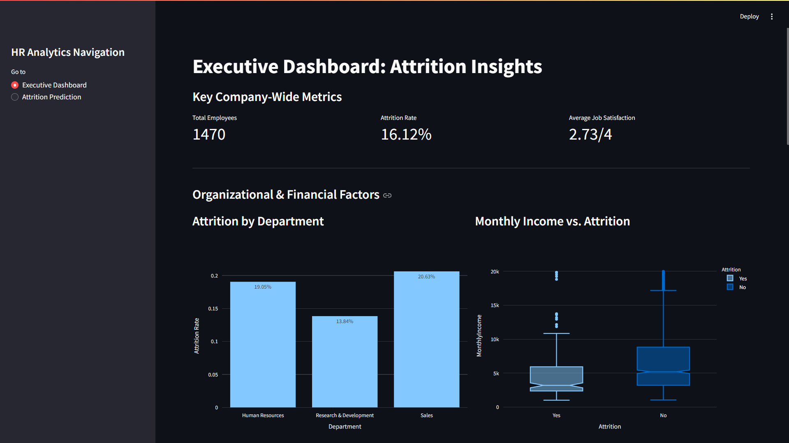
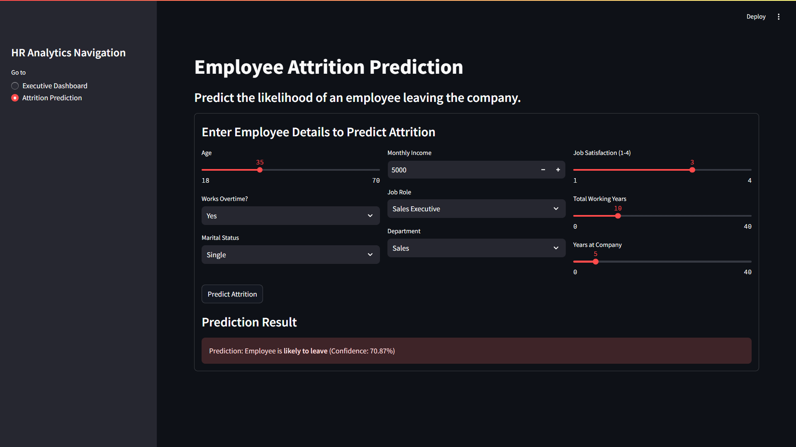

# Employee Attrition Analytics & Attrition Prediction Dashboard

This project features an interactive web application built with Streamlit for analyzing and predicting employee attrition. The dashboard provides HR teams with actionable insights through data visualizations and a predictive model to identify at-risk employees, enabling data-driven retention strategies.

## Dashboard Preview



---

## 1. Project Overview
The goal of this project is to address the critical business problem of employee turnover. By leveraging historical employee data, we have built a machine learning model that predicts the likelihood of an employee leaving the company. This predictive model is integrated into a user-friendly web dashboard that also provides rich visualizations for exploring the key factors driving attrition.

## 2. Key Features
- **Executive Dashboard:** A high-level overview of key HR metrics and visualizations on attrition drivers like department, income, job satisfaction, overtime, and demographics.
- **Predictive Modeling:** An interactive tool to predict attrition for an individual employee by inputting their details.
- **Data-Driven Insights:** A rich set of interactive charts to help HR teams understand *why* employees are leaving.
- **User-Friendly Interface:** A clean and simple UI built with Streamlit, requiring no technical expertise to use.

## 3. Tech Stack
- **Language**: Python 3.x
- **Web Framework**: Streamlit
- **Data Manipulation**: Pandas, NumPy
- **Machine Learning**: Scikit-learn
- **Data Visualization**: Plotly Express
- **Model Persistence**: Joblib

## 4. Project Structure
```
/your-project-folder
├── Model
├── Pictures
├── app.py
├── Employee.ipynb                        
├── Employee.csv
├── Model.py
├── Logistic_Model.py            
├── Preprocessed.csv             
└── README.md                  
```

## 5. Setup & Installation
Follow these steps to set up and run the project locally.

### **Step 1: Clone the Repository**
```bash
git clone (https://github.com/itz-Mayank/Employee_Attrition_Analysis_Prediction)
cd Employee_Attrition_Analysis_Prediction
```

### **Step 2: Create and Activate a Virtual Environment**
#### On macOS/Linux:
```bash
python3 -m venv venv
source venv/bin/activate
```
#### On Windows:
```bash
python -m venv venv
.\venv\Scripts\activate
```

### **Step 3: Install Dependencies**
```bash
pip install -r Requirements.txt
```

## 6. Usage
To launch the dashboard, run the following command in your terminal from the project's root directory:
```bash
streamlit run app.py
```
The application will open in a new tab in your web browser.

## 7. Detailed Project Report

### 7.1. The Business Problem
Employee attrition is a costly problem for any organization. Losing an employee results in costs related to recruitment, onboarding, and lost productivity. The goal of this project is to mitigate these costs by building a tool that can proactively identify employees who are at a high risk of leaving, allowing management to intervene with targeted retention strategies.

### 7.2. Data & Feature Engineering
The model was trained on a historical employee dataset. Key steps in data preparation included:

- **Cleaning**: Handling missing values and removing irrelevant columns.
- **Encoding**: Converting categorical features (e.g., Department, MaritalStatus) into a numerical format using one-hot encoding.
- **Feature Engineering**: Creating new features by binning continuous variables like Age and YearsAtCompany to help the model capture non-linear trends.
- **Balancing**: Addressing the class imbalance (fewer employees leave than stay) using techniques like class_weight to ensure the model learns effectively from the minority class.

### 7.3. Modeling & Evaluation
Several classification algorithms were tested, including Logistic Regression, Decision Tree, and Random Forest. Models were evaluated based on their F1-Score, Precision, and Recall, with a strong focus on the model's ability to correctly identify employees who will leave (the positive class). After extensive experimentation, a Logistic Regression model provided the best and most balanced performance.

### 7.4. Final Model Performance
The selected Logistic Regression model achieved the following performance on the test set:

| Metric     | Score | Interpretation                                                |
|------------|-------|--------------------------------------------------------------|
| Accuracy   | 90%   | Overall, the model correctly classifies 90% of all employees.|
| Precision  | 79%   | When the model predicts an employee will leave, it is correct 79% of the time.|
| Recall     | 53%   | The model successfully identifies 53% of all employees who actually leave.|
| F1-Score   | 63%   | The model achieves a healthy balance between Precision and Recall.|

This represents a strong, practical model. It significantly reduces the number of "false alarms" (low precision) while still identifying over half of all at-risk employees.

### 7.5. Understanding the Confusion Matrix
The confusion matrix provides a detailed breakdown of the model's predictions versus the actual outcomes on the test data.

|                 | Predicted: Stays | Predicted: Leaves |
|-----------------|------------------|--------------------|
| **Actual: Stays**   | 312 (True Negative) | 8 (False Positive)  |
| **Actual: Leaves**  | 26 (False Negative) | 22 (True Positive)   |

- **True Positives (2)**: The model correctly identified 22 employees who were going to leave.
- **False Positives (8)**: The model incorrectly flagged 8 employees as leaving, but they stayed.
- **False Negatives (26)**: The model missed 26 employees who left.

### 7.6. Key Insights from the Dashboard
The interactive visualizations on the dashboard revealed several key drivers of attrition:

- **Overtime**: Employees who work overtime have a significantly higher rate of attrition.
- **Monthly Income**: Attrition is more common among employees in lower income brackets.
- **Job Satisfaction**: As job satisfaction decreases, the rate of attrition steadily increases.
- **Age**: Younger employees, particularly those in their late 20s and early 30s, show a higher tendency to leave.

## 8. Deployment
This application is ready for deployment. The recommended platform is **Streamlit Community Cloud** due to its seamless integration with GitHub.

1. Push your project to a **public GitHub repository**.
2. Sign up for a **Streamlit Community Cloud** account.
3. Click "New app", select your repository, and deploy.

---

Feel free to contribute, raise issues, or suggest improvements!

